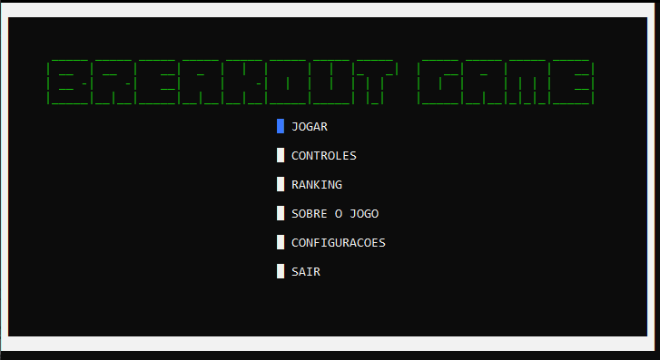
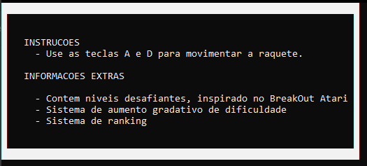
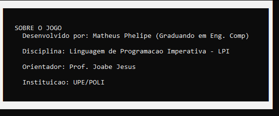
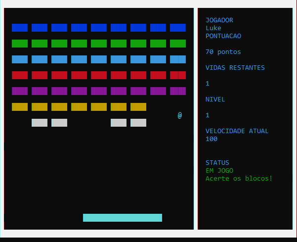
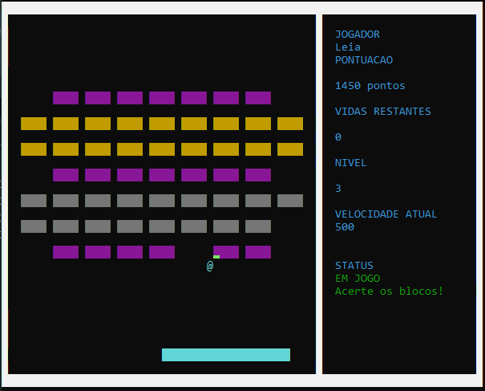
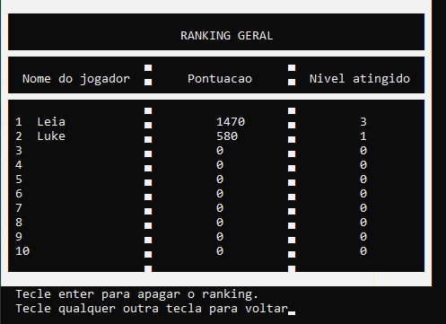

# Breakout-game-C

## Overview
###### Breakout is an arcade game developed and published by Atari, Inc., and released on May 13, 1976. It was conceptualized by Nolan Bushnell and Steve Bristow, influenced by the seminal 1972 Atari arcade game Pong, and built by Steve Wozniak.

That was my first project! I would like to thank my friends and professor during this developement! The game was made on discipline Imperative Programming Language, on Polytechnic School of Pernambuco.

## Features

- Ranking system
- Challeging levels (inspired by Breakout Game (Atari, Inc.)! 
- Gradual difficulty increase!
- Sound Effects like the original game

## Screenshots

###### Title screen

###### How to play

###### About

###### Gameplays

###### Ranking

